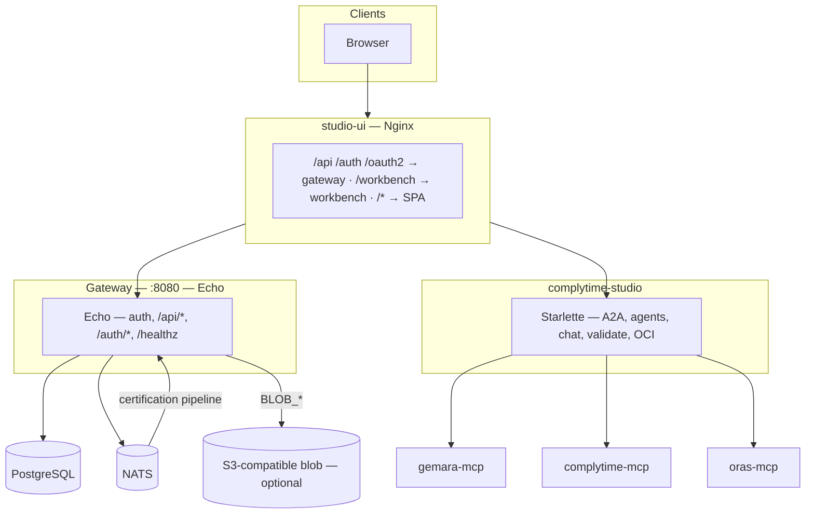
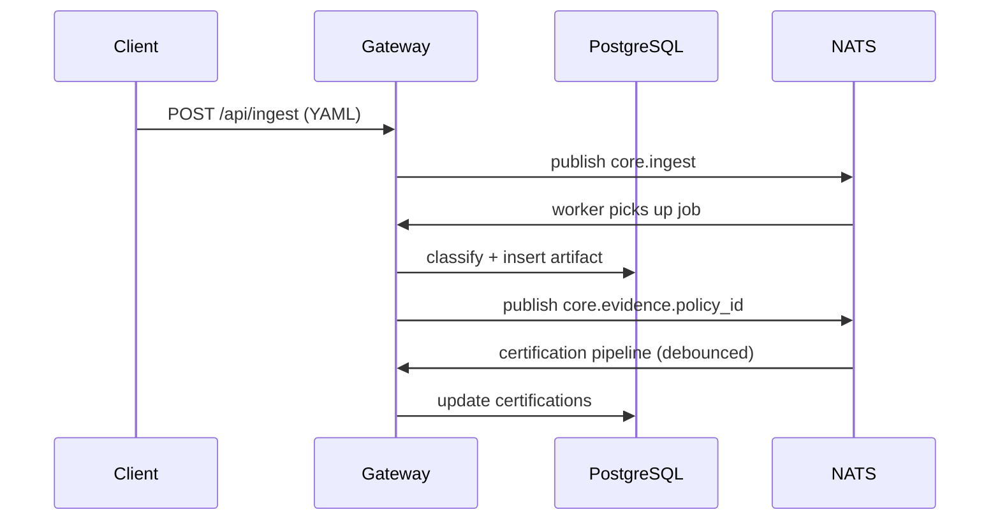

<!-- SPDX-License-Identifier: Apache-2.0 -->

# ComplyTime Core Architecture

The data platform API for the ComplyTime ecosystem. Stores and serves compliance evidence, policies, catalogs, and audit artifacts. Other services consume it via REST, MCP, or read-only SQL.

## System Overview

ComplyTime ships as four repositories. This repo owns the gateway and data layer.

| Boundary | Role | Tech | Repository |
|:--|:--|:--|:--|
| **Data Platform** | Headless API: evidence CRUD, certifier pipeline, ingest, auth | Go (Echo), PostgreSQL, NATS | [complytime-core](https://github.com/complytime-labs/complytime-core) |
| **Studio Workbench** | Agent support: A2A routing, chat, Gemara validation, OCI ops | Python (Starlette), LangGraph | [complytime-studio](https://github.com/complytime-labs/complytime-studio) |
| **Studio UI** | Analyst dashboard: posture, evidence, audit views, agent chat | Preact SPA, Nginx | [studio-ui](https://github.com/complytime-labs/studio-ui) |
| **Studio Deploy** | Helm chart for Kind/Kubernetes deployment | Helm | [studio-deploy](https://github.com/complytime-labs/studio-deploy) |

## Gateway (`cmd/gateway`)

Echo serves `/api/*`, `/auth/*`, and `/healthz` on a single port (default 8080). No embedded SPA, no A2A proxy, no agent directory.

| Concern | Implementation |
|:--|:--|
| HTTP | Echo — single listener, middleware stack |
| Data | `internal/store` + `internal/postgres` — single pool, `EnsureSchema` at startup |
| Events | `internal/events` — NATS; debounced certification pipeline on evidence subjects |
| Blobs | `internal/blob` — MinIO-compatible when `BLOB_*` set |
| Auth | `internal/auth` — OAuth2 Proxy `X-Forwarded-*` headers; sidecar localhost binding (ADR #0037) |

**Hard requirements:** `POSTGRES_URL` and `NATS_URL` must be set and reachable. Failure exits the process.

## Authentication

| Mode | Condition |
|:--|:--|
| **OAuth2 Proxy** | Sidecar handles OIDC, session cookies. Gateway binds to `127.0.0.1` (sidecar-only access). Reads `X-Forwarded-Email/User/Groups`. JWT validation for headless clients (ADR #0037). |
| **No proxy** | `/api/*` (except `/api/config`) returns 401 without `X-Forwarded-Email`. `POST /api/bootstrap` is the only write bypass. |

## NATS Subjects

| Subject | Use |
|:--|:--|
| `core.evidence.<policy_id>` | After ingest — debounced certification pipeline |
| `core.ingest` | Unified async ingest worker |
| `core.draft.<policy_id>` | Draft creation (no active subscribers) |

## Data Flow

## Key Routes

| Method(s) | Path | Notes |
|:--|:--|:--|
| GET | `/healthz` | Postgres ping |
| GET | `/api/config` | Non-secret config (public) |
| POST | `/api/bootstrap` | Create admin user (no auth required) |
| POST | `/api/ingest` | Unified Gemara ingest (async, 202) |
| GET | `/api/ingest/jobs/{job_id}` | Poll ingest job status |
| POST | `/api/import` | OCI bundle/artifact import |
| GET | `/api/policies`, `/api/policies/{id}` | Policy CRUD |
| GET | `/api/catalogs` | List catalogs |
| GET | `/api/evidence` | Query evidence |
| GET | `/api/requirements` | Requirements matrix |
| GET | `/api/posture` | Posture aggregates |
| GET, POST | `/api/audit-logs` | Audit log CRUD |
| GET, POST | `/api/draft-audit-logs` | Draft audit logs |
| POST | `/api/audit-logs/promote` | Promote draft to official |
| GET | `/auth/me` | Current user identity |

Full route registration: `internal/store/handlers.go`, `internal/auth/user_handlers.go`, `cmd/gateway/main.go`.

## Configuration

| Variable | Required | Purpose |
|:--|:--|:--|
| `POSTGRES_URL` | Yes | Application database |
| `NATS_URL` | Yes | Event bus |
| `PORT` | No | 8080 default |
| `BLOB_*` | No | Object storage |
| `CORS_ORIGINS` | No | Comma-separated allowed origins |

`GEMARA_MCP_URL` and `ORAS_MCP_URL` are workbench concerns, not gateway env vars.

## PostgreSQL

Single application database for all platform data: policies, evidence, catalogs, controls, mappings, certifications, posture, users, audit logs, jobs. ClickHouse is an optional analytical tier via `pg_clickhouse` FDW — the gateway never queries it directly.

## Testing

Integration tests in `internal/store/` and `internal/postgres/` require a live PostgreSQL instance. Set `POSTGRES_TEST_URL` to enable them. Without it, tests skip. CI does not currently provision PostgreSQL — run `make test-integration` locally.

## Related Docs

| Doc | Topic |
|:--|:--|
| [ADRs](decisions/) | Architecture decisions for the data platform |
| [API spec](api/openapi.yaml) | OpenAPI 3.1 definition |
| [Use case](use-case.md) | End-to-end audit workflow |
| [Agent data flows](design/agent-data-flows.md) | How agents interact with platform data |
| [Evidence semconv](design/evidence-semconv-alignment.md) | OTel semantic convention alignment |
| [SLRs](requirements/service-level-requirements.md) | Service level requirements |
