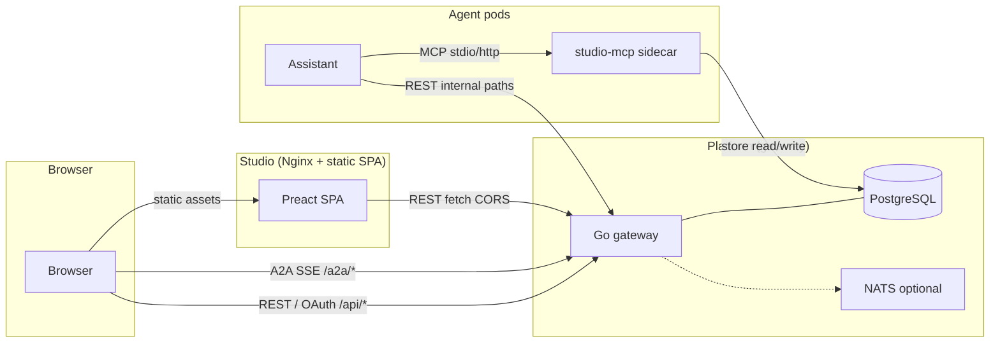

<!-- SPDX-License-Identifier: Apache-2.0 -->

# Three-component architecture

ComplyTime ships as three boundaries in one monorepo: **Platform** (API), **Studio** (SPA), and **Agents** (orchestrated workloads). Each boundary deploys independently; REST and MCP are the only supported integration seams.

## Components

| Boundary | Role | Primary tech |
|:--|:--|:--|
| **ComplyTime Platform** | Headless API: OAuth, REST `/api/*`, A2A proxy, optional MCP proxy, evidence/certifier pipeline, notifications | Go gateway (`cmd/gateway`), PostgreSQL (application store), optional NATS for events |
| **ComplyTime Studio** | Analyst UI: posture, evidence, audit views, assistant chat shell | Preact SPA in `studio/`, Nginx container, runtime `PLATFORM_URL` via `env.js` |
| **ComplyTime Agents** | Gap analysis and synthesis (e.g. studio-assistant) | LangGraph / ADK runtime, `skills/`, MCP sidecars: gemara-mcp, studio-mcp (platform data), oras-mcp (OCI) |

## Communication

| Client | Target | Protocol | Notes |
|:--|:--|:--|:--|
| Browser | Studio | HTTP static | SPA loads `env.js` then calls Platform with configured origin |
| Browser | Platform | REST, OAuth, A2A/SSE | Cross-origin from Studio requires `CORS_ORIGINS` |
| Studio SPA | Platform | REST | Base URL from `window.__STUDIO_CONFIG__.platformUrl` |
| Agents | Platform | REST | Trusted paths (e.g. internal listener) where applicable |
| Agents | studio-mcp | MCP | Typed `studio://` resources + tools; no raw SQL |

## Related docs

| Doc | Topic |
|:--|:--|
| [OpenAPI](api/openapi.yaml) | REST contract |
| [studio-mcp](api/studio-mcp.md) | MCP resources and tools |
| [ADR: three-component split](decisions/three-component-architecture.md) | Rationale |
