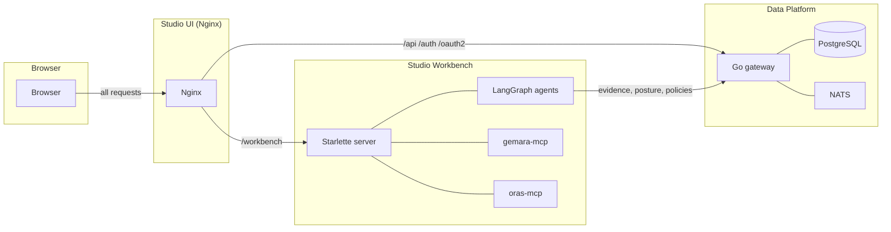

<!-- SPDX-License-Identifier: Apache-2.0 -->

# Architecture

ComplyTime ships as four repositories: **Data Platform** (API), **Studio Workbench** (agent support), **Studio UI** (SPA), and **Studio Deploy** (Helm chart + Docker Compose). Each boundary deploys independently; container images are the contract, REST and MCP are the integration seams.

## Components

| Boundary | Role | Primary tech | Repository |
|:--|:--|:--|:--|
| **Data Platform** | Headless data API: evidence CRUD, certifier pipeline (in-process), posture reads, content ingestion, auth | Go gateway (`cmd/gateway`), PostgreSQL, NATS | [complytime-core](https://github.com/complytime-labs/complytime-core) |
| **Studio Workbench** | Agent support: A2A routing, agent directory, chat state, Gemara validation, OCI publish/browse | Python (Starlette), LangGraph, MCP clients | [complytime-studio](https://github.com/complytime-labs/complytime-studio) |
| **Studio UI** | Batteries-included analyst UI: posture, evidence, audit views, agent chat shell | Preact SPA, Nginx reverse-proxy | [studio-ui](https://github.com/complytime/studio-ui) |
| **Studio Deploy** | Helm chart and Docker Compose for local/cluster deployment | Helm, Docker Compose | [studio-deploy](https://github.com/complytime/studio-deploy) |

## Communication

| Client | Target | Protocol | Path | Notes |
|:--|:--|:--|:--|:--|
| Browser | Studio UI (Nginx) | HTTP | `/*` | Single entry point |
| Nginx | Data Platform | REST | `/api/*`, `/auth/*`, `/oauth2/*` | Data CRUD, auth |
| Nginx | Workbench | REST, SSE | `/workbench/*` | Agent interactions, tool calls |
| Agents | Data Platform | REST | `/api/evidence`, `/api/posture`, etc. | Read/write compliance data |
| Agents | gemara-mcp | MCP | stdio/http | Artifact validation, schema queries |
| Agents | oras-mcp | MCP | stdio/http | Registry operations |

## Data Platform API Surface

The data platform serves only data CRUD and background pipelines:

- Evidence ingestion and query
- Certifications query
- Posture reads
- Policies, catalogs, mappings CRUD
- Requirements matrix
- Audit logs and drafts
- Threats, risks (catalog-derived)
- Users, roles, auth
- Content ingestion from OCI registries
- Certifier pipeline (in-process goroutine, NATS-triggered)

## Workbench API Surface

The workbench serves agent-support concerns:

- A2A protocol routing to agents (`/workbench/a2a/*`)
- Agent directory (`/workbench/agents`)
- Chat conversation state (`/workbench/chat/*`)
- Gemara validate/migrate (`/workbench/validate`, `/workbench/migrate`)
- OCI publish (`/workbench/publish`)
- Registry browse (`/workbench/registry/*`)

## Related Docs

| Doc | Topic |
|:--|:--|
| [ADR: Data Platform + Workbench Split](decisions/data-platform-workbench-split.md) | Why we split |
| [Service Level Requirements](requirements/service-level-requirements.md) | SLRs and gap analysis |
| complytime-mcp | MCP resources and tools for agents (platform data via `complytime://*` URIs) |
