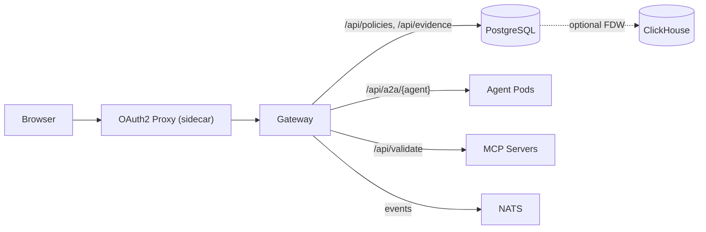

# Backend Architecture: Modulith Gateway

**Status:** Superseded by [Data Platform + Workbench Split](data-platform-workbench-split.md)
**Date:** 2026-04-18 (updated 2026-05-06, superseded 2026-05-13)

## Context

The gateway is a Go monolith serving six concerns: SPA, OAuth2 Proxy header trust, A2A proxy, MCP proxy, store CRUD, and config. We evaluated whether decomposition improves development velocity, scalability, or fault isolation.

## Decision

**Single modulith gateway with the A2A proxy embedded.**

- The A2A reverse proxy runs inside the gateway process. It is architecturally isolated (`internal/agents/` imports only `internal/consts` and `internal/httputil`) but does not warrant a separate deployment at current scale.
- Domain-specific store interfaces (`EvidenceStore`, `PolicyStore`, `AuditLogStore`, `MappingStore`) backed by PostgreSQL enable future extraction without code changes.

## Architecture

PostgreSQL is the primary application database. ClickHouse is optional for scale-out analytics via foreign data wrapper (see ADR-0001).

## Superseded

The A2A proxy, agent directory, chat state, and MCP proxy concerns were extracted into the **Studio Workbench** (Python, Starlette) in the [complytime-studio](https://github.com/complytime-labs/complytime-studio) repo. The gateway (`cmd/gateway`) is now a pure data platform — `internal/agents/`, `internal/proxy/`, `internal/publish/`, and `internal/registry/` were deleted. See [Data Platform + Workbench Split](data-platform-workbench-split.md).

## Rejected Alternatives

| Option | Reason |
|:--|:--|
| Extract evidence service | Shared PostgreSQL schema negates isolation benefit |
| Full decomposition (gateway, A2A, evidence, store) | Overkill at current scale. Auth propagation and debugging complexity not justified. |
