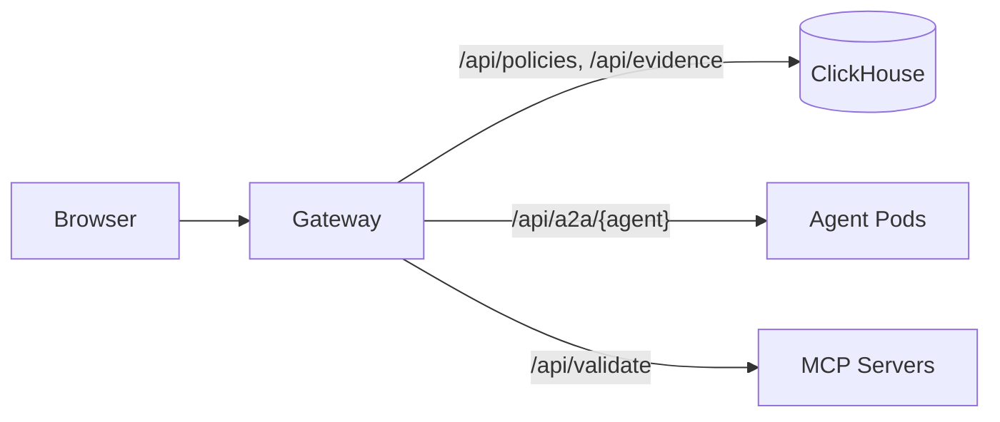

# Backend Architecture: Modulith Gateway

**Status:** Accepted
**Date:** 2026-04-18 (updated 2026-04-18)

## Context

The gateway is a Go monolith serving six concerns: SPA, OAuth, A2A proxy, MCP proxy, store CRUD, and config. We evaluated whether decomposition improves development velocity, scalability, or fault isolation.

## Decision

**Single modulith gateway with the A2A proxy embedded.**

- The A2A reverse proxy runs inside the gateway process. It is architecturally isolated (`internal/agents/` imports only `internal/consts` and `internal/httputil`) but does not warrant a separate deployment at current scale.
- Domain-specific store interfaces (`EvidenceStore`, `PolicyStore`, `AuditLogStore`, `MappingStore`) enable future extraction without code changes.

## Architecture

## Future: A2A Proxy Extraction

The A2A proxy is the natural candidate for extraction when load or team boundaries justify it.

**Trigger:** Measured contention between long-lived SSE streams (chat) and short-lived CRUD requests sharing the same Go process.

**Seam:** `internal/agents/` has zero database coupling and zero session state. Extraction is a packaging change:

1. Build `internal/agents` as a standalone binary
2. Deploy as a separate Kubernetes Deployment
3. Set `A2A_PROXY_URL` on the gateway to forward `/api/a2a/` traffic
4. The gateway's `A2A_PROXY_URL` forwarding path already exists in `cmd/gateway/main.go`

**Not done now because:**
- Single-digit concurrent users, no measured contention
- One deployment is simpler to operate, debug, and port-forward
- The architectural seam is preserved in code — extraction doesn't require a rewrite

## Rejected Alternatives

| Option | Reason |
|:--|:--|
| Extract evidence service | Shared ClickHouse schema negates isolation benefit |
| Full decomposition (gateway, A2A, evidence, store) | Overkill at current scale. Auth propagation and debugging complexity not justified. |
