# Agent Data Flow Architecture

Data flow diagrams for ComplyTime Studio's multi-agent platform, traced from the workbench UI through the gateway to each specialist agent and its backend services.

## System Architecture

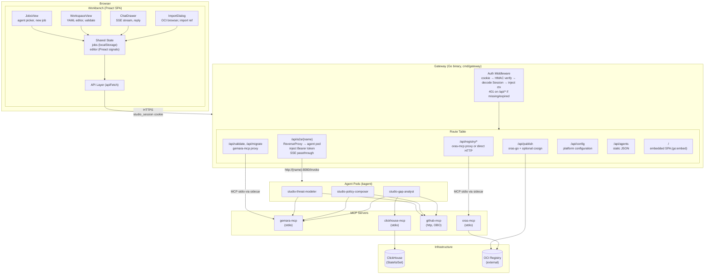

## Authentication & On-Behalf-Of Flow

All agent communication routes through the gateway. The user's GitHub token propagates end-to-end. github-mcp uses `http` transport — each request carries the calling user's `Authorization: Bearer` header. No static `GITHUB_PERSONAL_ACCESS_TOKEN` exists in the deployment.

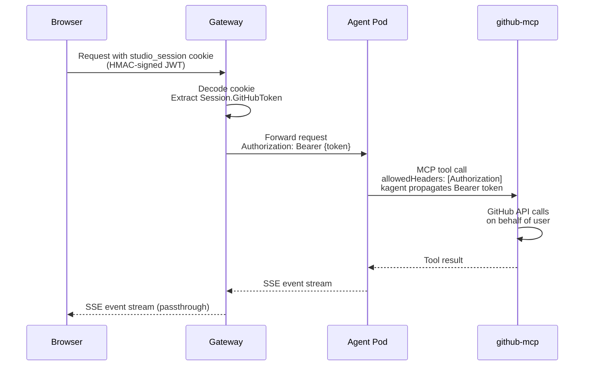

## Workbench Data Flow

### Job Lifecycle

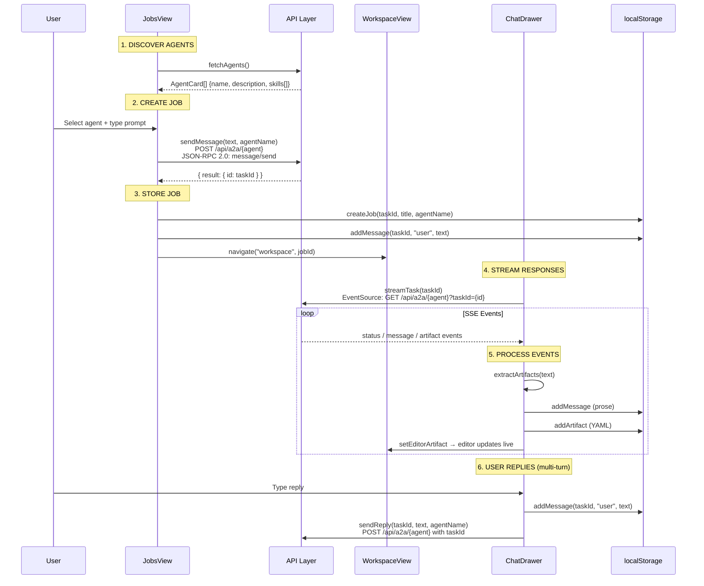

### Artifact Detection Pipeline

When agent responses arrive, the workbench extracts Gemara artifacts from markdown code blocks.

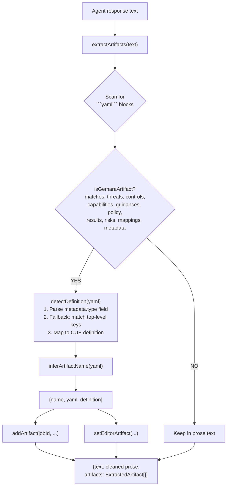

### Post-Authoring Actions

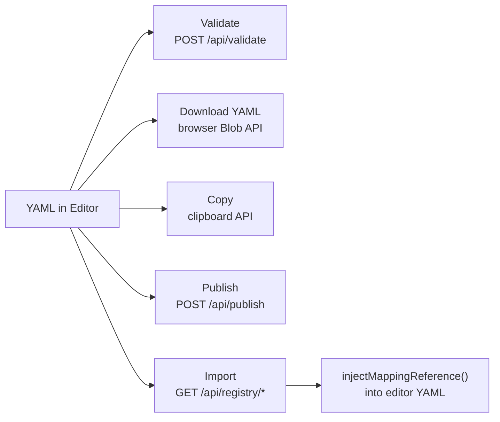

## Agent Data Flows

### Shared Agent Infrastructure

All agents share this deployment pattern on Kubernetes.

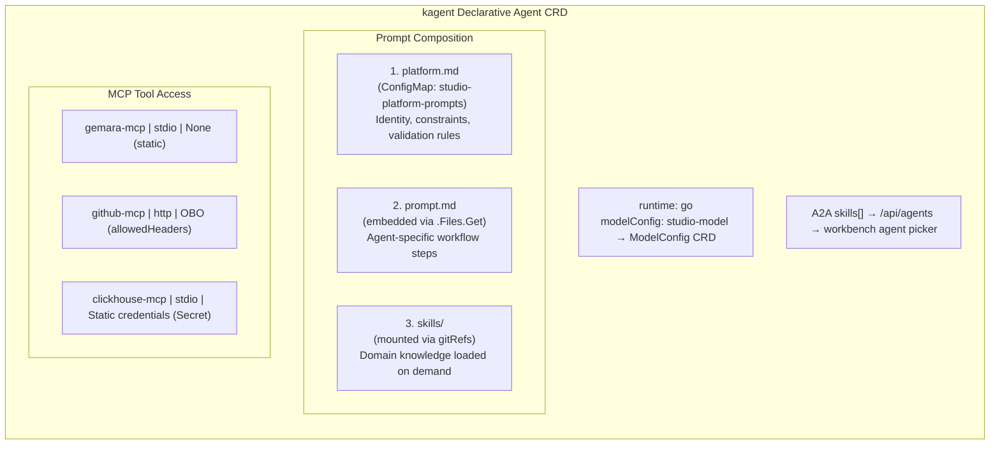

### Agent 1: studio-threat-modeler (Layer 2 — Controls)

STRIDE-based threat analysis. Consumes GitHub repository content, produces ThreatCatalog and ControlCatalog artifacts.

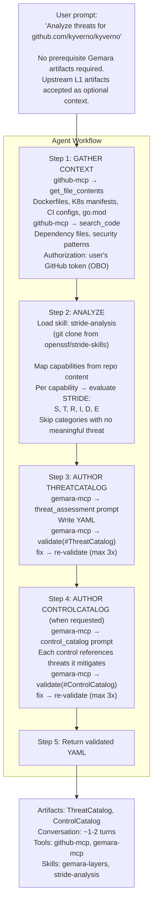

### Agent 2: studio-policy-composer (Layer 3 — Policy)

RiskCatalog and Policy authoring through guided two-phase conversation. Facilitates; derives defaults from input artifacts.

```mermaid
flowchart TB
    Input["REQUIRED:<br/>ThreatCatalog (from threat-modeler)<br/>ControlCatalog (from threat-modeler)<br/><br/>OPTIONAL:<br/>GuidanceCatalog<br/><br/>If either required input missing → agent halts"]

    Input --> P1

    subgraph Phase1["Phase 1: Risk Catalog"]
        P1["Step 1: Derive RiskCategories<br/>Examine ThreatCatalog.groups<br/>→ propose candidates with appetite<br/>→ present table for user confirmation"]

        P2["Step 2: Derive Risk Entries<br/>Per threat → derive Risk with severity<br/>→ present summary table"]

        P3["Step 3: Validate<br/>gemara-mcp → validate(#RiskCatalog)<br/>Confirm with user before Phase 2"]

        P1 --> P2 --> P3
    end

    P3 --> P4

    subgraph Phase2["Phase 2: Policy"]
        P4["Step 4: RACI contacts"]
        P5["Step 5: Scope (derive from ControlCatalog)"]
        P6["Step 6: Import ControlCatalog"]
        P7["Step 7: Risk-to-Control Linkage<br/>Load skill: policy-risk-linkage<br/>Join risks ↔ controls on shared threat refs<br/>Mitigated: ≥1 shared threat ref<br/>Accepted: no controls + justification<br/>Unmitigated: awaiting decision"]
        P8["Step 8: Assessment plans"]
        P9["Step 9: Enforcement"]
        P10["Step 10: Implementation timeline"]
        P11["Step 11: Validate<br/>gemara-mcp → validate(#Policy)"]

        P4 --> P5 --> P6 --> P7 --> P8 --> P9 --> P10 --> P11
    end

    P11 --> Output

    Output["Artifacts: RiskCatalog, Policy<br/>Conversation: ~8-10 turns (guided)<br/>Tools: github-mcp, gemara-mcp<br/>Skills: gemara-layers, policy-risk-linkage, assessment-defaults"]
```

### Agent 3: studio-gap-analyst (Layer 7 — Audit)

Combined audit preparation assistant. Derives target inventory from evidence, assesses criteria coverage per target, translates coverage through MappingDocuments to external compliance frameworks using strength and confidence scores.

```mermaid
flowchart TB
    Input["REQUIRED:<br/>Policy (YAML or policy_id)<br/>Audit timeline (start, end) — user-provided<br/>MappingDocuments (1..N, one per framework)<br/><br/>Without MappingDocuments: internal-only analysis<br/>Without Policy or timeline: agent halts"]

    Input --> S1

    subgraph Phase1["Phase 1: Scope & Inventory"]
        S1["Step 1: Confirm audit scope<br/>Policy, timeline, frameworks → summary table"]

        S2["Step 2: Derive target inventory<br/>clickhouse-mcp → run_select_query<br/>SELECT DISTINCT target_id, target_name,<br/>min(collected_at), max(collected_at), count(*)<br/>FROM evidence<br/>WHERE policy_id = ? AND collected_at BETWEEN ? AND ?<br/>→ present inventory, user confirms targets"]

        S3["Step 3: Load criteria<br/>Parse Policy → imports.catalogs[]<br/>→ extract controls + assessment requirements<br/>= complete criteria set"]

        S1 --> S2 --> S3
    end

    S3 --> S4

    subgraph Phase2["Phase 2: Evidence Assessment (per target)"]
        S4["Step 4: Query evidence<br/>clickhouse-mcp → run_select_query<br/>evidence table (by policy_id, target_id, timeline)<br/>Evaluations and remediations co-located in single table"]

        S5["Step 5: Validate assessment cadence<br/>Policy.adherence.assessment-plans[].frequency<br/>→ compute expected cycles across audit window<br/>→ compare actual timestamps<br/>→ MISSING CYCLES = FINDING (non-compliance)<br/><br/>Example: policy=daily, window=90d<br/>Expected: 90 — Found: 87<br/>Gaps: Feb 12, Mar 3, Mar 17 → 3 Findings"]

        S6["Step 6: Classify each criteria entry<br/>Load skill: audit-classification"]

        S7["Step 7: Assemble AuditLog<br/>One AuditResult per criteria entry<br/>gemara-mcp → validate(#AuditLog)<br/>fix → re-validate (max 3x)"]

        S4 --> S5 --> S6 --> S7
    end

    S7 --> S8

    subgraph Phase3["Phase 3: Cross-Framework Coverage"]
        S8["Step 8: Join AuditResults with MappingDocuments<br/>AuditResult.criteria-reference → Mapping.source<br/>→ Mapping.targets[].entry-id (external framework)<br/>→ read .strength (1-10) and .confidence-level"]

        S9["Step 9: Classify framework coverage<br/>Multiple controls → same entry: strongest wins"]

        S10["Step 10: Present coverage matrix<br/>Per-framework summary (counts by status)<br/>Attention items (sorted by risk)<br/>Embed framework context in AuditResult.recommendations[]"]

        S8 --> S9 --> S10
    end

    S10 --> S11

    subgraph Phase4["Phase 4: Output"]
        S11["Step 11: Emit multi-YAML-doc<br/>One AuditLog per target, separated by ---<br/>Each doc independently valid against #AuditLog"]

        S12["Step 12: Present cross-framework summary<br/>Conversational (not a Gemara artifact — it's a view)<br/>Highlight items needing human attention"]

        S11 --> S12
    end

    S12 --> Output

    Output["Artifacts: AuditLog (per target, multi-YAML-doc)<br/>Conversation: ~4-6 turns<br/>Tools: clickhouse-mcp, gemara-mcp, github-mcp<br/>Skills: gemara-layers, audit-classification"]
```

#### Cross-Framework Coverage Classification

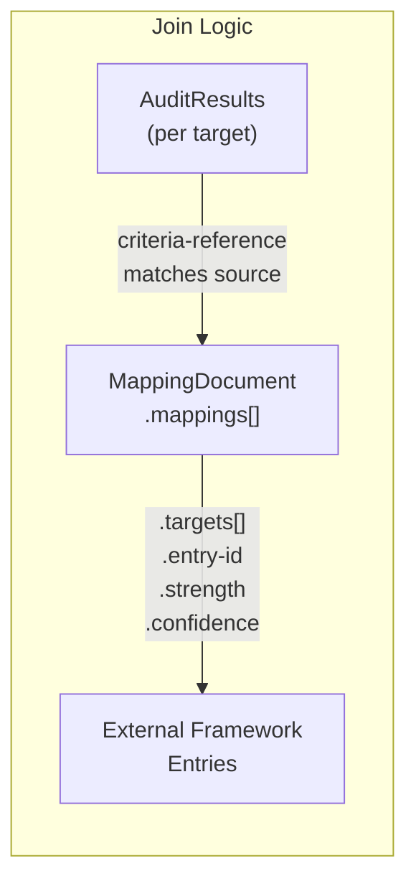

| AuditResult Type | Mapping Strength | Confidence | Framework Coverage |
|:--|:--|:--|:--|
| Strength | 8-10 | High | Covered |
| Strength | 5-7 | Medium/High | Partially Covered |
| Strength | 1-4 | any | Weakly Covered |
| Finding | any | any | Not Covered (finding) |
| Gap | any | any | Not Covered (no evidence) |
| Observation | any | any | Needs Review |
| (no mapping) | — | — | Unmapped |

## Evidence Ingestion Pipeline

Evidence reaches ClickHouse through three paths. Evaluations and remediations are co-located in a single `evidence` table.

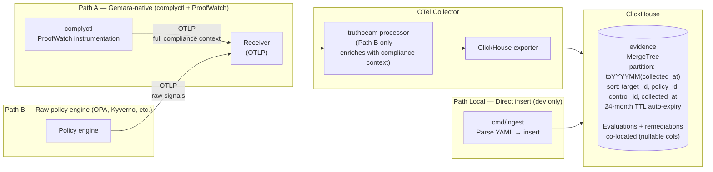

## Artifact Pipeline Across Agents

Agents form a pipeline. Artifacts produced by upstream agents are consumed by downstream agents.

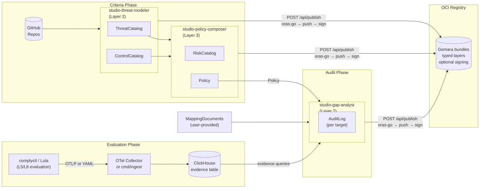

## Summary

| Dimension | threat-modeler | policy-composer | gap-analyst |
|:--|:--|:--|:--|
| **Gemara Layer** | L2 (Controls) | L3 (Policy) | L7 (Audit) |
| **Inputs** | GitHub repo content | ThreatCatalog + ControlCatalog | Policy + ClickHouse evidence + MappingDocuments |
| **Outputs** | ThreatCatalog, ControlCatalog | RiskCatalog, Policy | AuditLog (per target, multi-doc) |
| **Conversation** | ~1-2 turns | ~8-10 turns (guided) | ~4-6 turns (guided) |
| **MCP: gemara** | validate, prompts | validate | validate |
| **MCP: github** | get_file_contents, search_code | get_file_contents, search_code | get_file_contents, search_code |
| **MCP: clickhouse** | — | — | run_select_query, list_tables |
| **Skills** | gemara-layers, stride-analysis | gemara-layers, policy-risk-linkage, assessment-defaults | gemara-layers, audit-classification |
| **OBO token** | Yes | Yes | Yes |
