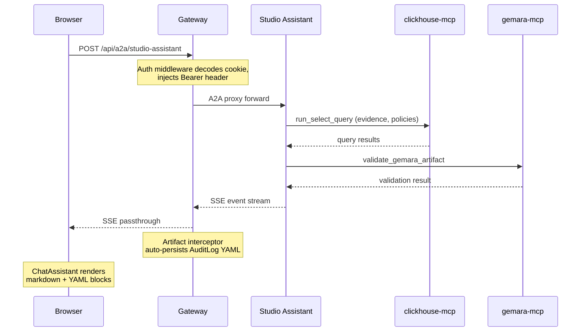
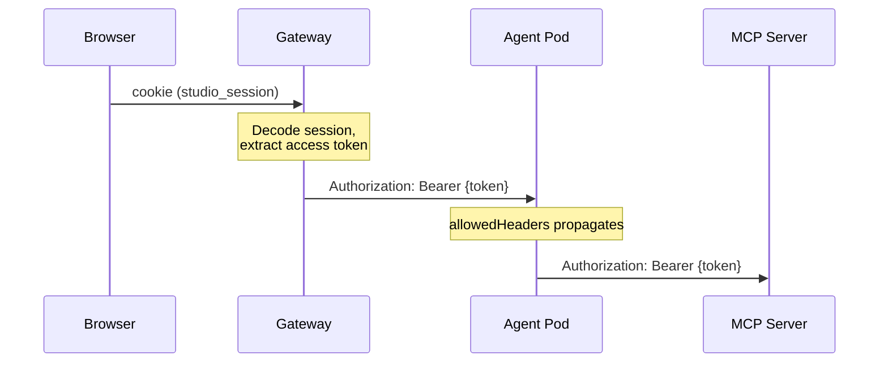

# Agent Data Flows

Data flow diagrams for ComplyTime Studio, traced from the workbench UI through the gateway to the studio assistant and its backend services.

## End-to-End Request Flow

## Authentication Flow

When OAuth is disabled, no token propagation occurs. MCP servers use static credentials from Secrets.

## Job Lifecycle

1. User opens ChatAssistant overlay, types prompt
2. Workbench `POST /api/a2a/studio-assistant` (JSON-RPC: `message/send`)
3. Gateway proxies to studio-assistant pod
4. Assistant queries ClickHouse via clickhouse-mcp (evidence, policies)
5. Assistant produces AuditLog YAML, validates via gemara-mcp
6. SSE events stream back through gateway to browser
7. ChatAssistant renders response as markdown with YAML/mermaid blocks
8. Gateway auto-persists valid AuditLog artifacts to ClickHouse
9. User sees "Auto-saved" indicator; can manually re-save via button

## Agent Response Rendering

Agent responses stream as SSE events containing markdown text. The ChatAssistant component renders this via `renderMarkdown()`. YAML code blocks in the response are displayed as formatted code within the chat conversation.

**Artifact persistence:** The gateway SSE interceptor detects `TaskArtifactUpdateEvent` payloads with `mimeType: application/yaml`, parses them via `ParseAuditLog`, and auto-persists valid AuditLog artifacts to ClickHouse. The frontend displays an "Auto-saved" indicator on artifact cards. Manual re-save via "Save to Audit History" is idempotent (content-addressed `audit_id` deduplicates via `ReplacingMergeTree`).

## Assistant Capabilities

The studio assistant is a single BYO ADK agent focused on audit preparation. It replaces three previously planned specialist agents (threat-modeler, policy-composer, gap-analyst) that were cut in the [audit dashboard pivot](../decisions/audit-dashboard-pivot.md).

**Inputs:** Policy (YAML or policy_id), audit timeline, MappingDocuments (optional).

**Outputs:** AuditLog artifacts grounded in ClickHouse evidence data.

**Skills:** gemara-mcp, evidence-schema, audit-methodology, coverage-mapping.

**Tools:**

| MCP Server | Tools Used | Purpose |
|:--|:--|:--|
| clickhouse-mcp | `run_select_query`, `list_tables` | Query evidence, policies, mappings |
| gemara-mcp | `validate_gemara_artifact`, `migrate_gemara_artifact` | Validate output, access schema/lexicon resources |

## Evidence Query Patterns

The assistant uses these ClickHouse queries via clickhouse-mcp:

| Query | Purpose |
|:--|:--|
| `SELECT DISTINCT target_id, target_name, count(*) FROM evidence WHERE policy_id = ? AND collected_at BETWEEN ? AND ?` | Derive target inventory for audit scope |
| `SELECT * FROM evidence WHERE policy_id = ? AND target_id = ? AND collected_at BETWEEN ? AND ?` | Per-target evidence for assessment |
| `SELECT * FROM policies WHERE policy_id = ?` | Load policy content |
| `SELECT * FROM mapping_documents WHERE policy_id = ?` | Load cross-framework crosswalks |

## Cross-Framework Coverage

When MappingDocuments are available, the assistant maps internal audit results to external framework entries.

| AuditResult Type | Mapping Strength | Framework Coverage |
|:--|:--|:--|
| Strength | 8-10 | Covered |
| Strength | 5-7 | Partially Covered |
| Strength | 1-4 | Weakly Covered |
| Finding | any | Not Covered (finding) |
| Gap | any | Not Covered (no evidence) |
| Observation | any | Needs Review |
| (no mapping) | — | Unmapped |
