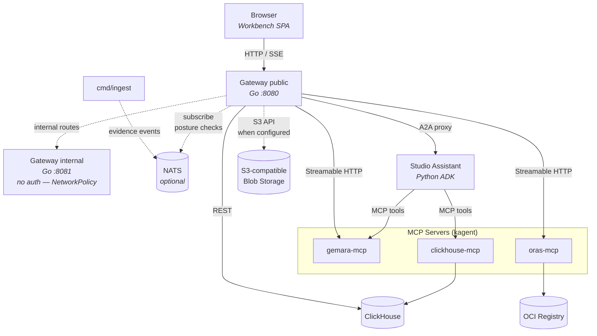
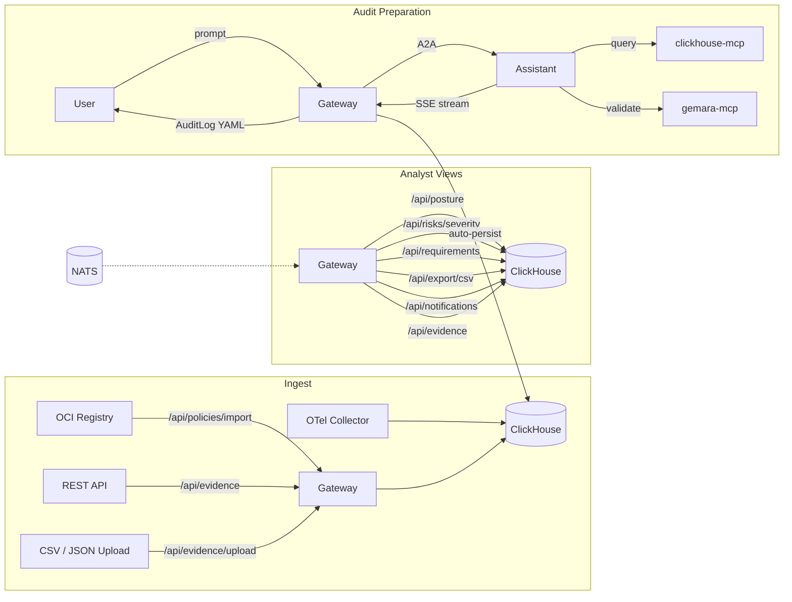

# ComplyTime Studio Architecture

## Overview

Compliance analytics and audit preparation platform. Studio aggregates policies from OCI registries, ingests evidence via OTel/REST/CSV, and provides structured views (posture, requirement matrix, evidence inventory, audit history) for compliance analysts and auditors. An agentic assistant augments these views with synthesis and gap analysis, producing [Gemara](https://gemara.openssf.org/) AuditLog artifacts.

Artifact authoring (ThreatCatalogs, ControlCatalogs, Policies) is handled by engineers using local tooling + gemara-mcp. Studio focuses on **consumption, analysis, and audit preparation**.

## System Diagram

## Components

### Gateway (Go)

User-facing entry point on **`PORT` (default 8080)**. Serves the embedded Preact SPA, REST APIs, Google OAuth, export endpoints, and proxies for MCP tools, OCI registries, and A2A agent communication. A second listener on **`INTERNAL_PORT` (default 8081)** serves cluster-internal routes only (`POST /internal/draft-audit-logs`, `/healthz`) with **no auth** — restrict with Kubernetes `NetworkPolicy` in production (`NETWORKPOLICY_ENFORCED` documents that expectation at startup).

| Concern | Implementation |
|:--|:--|
| HTTP servers | Public `ServeMux` (auth + middleware); internal `ServeMux` on separate port |
| Data access | `internal/store` interfaces backed by ClickHouse |
| Authentication | Google OAuth (OpenID Connect) with AES-GCM encrypted session cookies |
| Authorization | `simple-authz` -- admin/viewer roles via email allowlist in `ADMIN_EMAILS` |
| Event bus | Optional NATS (`NATS_URL`) — subscribe to evidence events, debounce, run posture checks, write inbox notifications |
| A2A proxy | Reverse proxy to agent pods via kagent A2A endpoint |
| Artifact persistence | SSE interceptor auto-persists AuditLog artifacts from A2A stream to ClickHouse |
| MCP proxy | Streamable HTTP client to gemara-mcp |
| OCI operations | ORAS MCP for secure registries, direct HTTP for insecure (dev) registries |
| Schema init | `EnsureSchema` creates tables on startup (90 retries, 2s backoff) |
| Export | CSV, Excel, PDF via `GET /api/export/{format}` (row caps in `internal/consts`) |
| Blob storage | S3-compatible (MinIO API) when `BLOB_*` env vars set; multipart and JSON evidence can attach files |

**Supporting packages (Go):**

| Package | Role |
|:--|:--|
| `internal/events` | NATS bus, evidence subscription, debounced posture-check handler |
| `internal/blob` | Blob store config, validation, MinIO client |
| `internal/gemara` | Parse policies, catalogs, controls, threats, risks, mappings, AuditLog shapes |
| `internal/ingest` | Evidence normalization for OTel-style payloads |
| `internal/clickhouse` | Client, schema, migrations |

**Store interfaces:**

| Interface | Methods |
|:--|:--|
| `PolicyStore` | `InsertPolicy`, `ListPolicies`, `GetPolicy` |
| `EvidenceStore` | `InsertEvidence`, `QueryEvidence` |
| `AuditLogStore` | `InsertAuditLog`, `ListAuditLogs`, `GetAuditLog` |
| `MappingStore` | `InsertMappingDocument`, `ListMappingDocuments` |
| `RequirementStore` | `ListRequirementMatrix`, `ListRequirementEvidence` |
| `PostureStore` | `ListPosture(ctx, start, end time.Time)` — optional time range filters evidence by `collected_at` when `start`/`end` are non-zero |
| `CatalogStore` | `InsertCatalog`, `ListCatalogs`, `GetCatalog` |
| `ControlStore` | `InsertControls`, `ListControls` |
| `ThreatStore` | `InsertThreats`, `ListThreats` |
| `DraftAuditLogStore` | `InsertDraftAuditLog`, `ListDraftAuditLogs`, `GetDraftAuditLog`, `UpdateDraftEdits`, `PromoteDraftAuditLog` |
| `EvidenceAssessmentStore` | `InsertEvidenceAssessments` |
| `RiskStore` | `InsertRisks`, `InsertRiskThreats`, `CountRisks`, `GetPolicyRiskSeverity` |
| `NotificationStore` | `InsertNotification`, `ListNotifications`, `MarkRead`, `UnreadCount` |

### Studio Assistant (Python)

BYO ADK agent built with Google Agent Development Kit. Runs as a standalone Kubernetes Deployment.

| Concern | Implementation |
|:--|:--|
| Framework | Google ADK `LlmAgent` + `A2aAgentExecutor` + Starlette/Uvicorn |
| Model | Configurable via `MODEL_NAME` env var |
| Tools | MCP toolsets for gemara-mcp (with resources) and clickhouse-mcp (filtered to `run_select_query`, `list_databases`, `list_tables`) |
| Callbacks | `before_agent` (input validation), `after_agent` (artifact extraction), `before_tool` (SQL injection guard) |
| Skills | Loaded from `/app/skills/*/SKILL.md` at startup, appended to system prompt |
| Few-shot examples | Loaded from `/app/prompts/few-shot/*.yaml` at startup, appended after skills |
| Provenance | `PROMPT_VERSION` (SHA-256 of full instruction) and `MODEL_NAME` injected into A2A artifact metadata |

**State model:** All runtime state is **ephemeral**. Sessions, tasks, artifacts, memory, and credentials use ADK's `InMemory*` services and do not survive pod restarts.

| Service | Scope | On restart |
|:--|:--|:--|
| `InMemorySessionService` | Conversation session (agent turns, tool calls) | Lost -- agent starts fresh |
| `InMemoryTaskStore` | A2A task tracking (task ID -> state) | Lost -- client must start a new task |
| `InMemoryArtifactService` | Artifacts produced during a task | Lost -- artifacts already streamed to client via SSE |
| `InMemoryMemoryService` | Long-term memory across sessions | Lost -- no long-term memory persists today |
| `InMemoryCredentialService` | OAuth tokens for tool auth | Lost -- re-acquired on next tool call |

**Continuity mechanisms:**
- The frontend injects dashboard context (view, policy, time range, control, requirement, evidence filters) and sticky notes into each message via `buildInjectedContext`, providing the agent with situational awareness independent of server-side session state.
- When the A2A `taskId` survives (no pod restart), `streamReply` resumes the existing task with raw user text only -- no re-injection of dashboard context.
- Server-side conversation turn storage in the gateway ensures `taskId` and message history survive page refresh. Pod restart clears agent-side state -- accepted tradeoff until auth sessions migrate to durable storage.

### ClickHouse

Primary datastore. Deployed as a StatefulSet with PVC. Two consumer profiles:

- **Gateway (Go):** Batch inserts on ingest, point lookups, list queries, requirement matrix joins, posture aggregation, and export queries for the REST API.
- **Agent (via clickhouse-mcp):** Analytical queries -- `GROUP BY`, `JOIN`, `count(DISTINCT)`, `groupArray` over evidence at scale.

| Table | Engine | Partition | Purpose |
|:--|:--|:--|:--|
| `evidence` | ReplacingMergeTree | `toYYYYMM(collected_at)` | Evaluation results, attestation refs, blob refs |
| `policies` | ReplacingMergeTree | -- | Imported policy artifacts |
| `mapping_documents` | ReplacingMergeTree | -- | Cross-framework crosswalks |
| `mapping_entries` | ReplacingMergeTree | -- | Structured entries from mapping documents |
| `audit_logs` | ReplacingMergeTree | `toYYYYMM(audit_start)` | AuditLog artifacts with provenance |
| `draft_audit_logs` | ReplacingMergeTree | `toYYYYMM(audit_start)` | Draft audit logs before promotion |
| `controls` | ReplacingMergeTree | -- | Parsed ControlCatalog entries |
| `assessment_requirements` | ReplacingMergeTree | -- | Assessment requirements linked to controls |
| `control_threats` | ReplacingMergeTree | -- | Junction: controls -> threats |
| `threats` | ReplacingMergeTree | -- | Parsed ThreatCatalog entries |
| `evidence_assessments` | MergeTree | -- | Classification assessments on evidence |
| `risks` | ReplacingMergeTree | -- | Parsed risk catalog entries |
| `risk_threats` | ReplacingMergeTree | -- | Junction: risks -> threats |
| `catalogs` | ReplacingMergeTree | -- | Raw catalog artifacts for backfill |
| `notifications` | ReplacingMergeTree | -- | Inbox notifications (posture/evidence events); TTL 90d |
| `schema_migrations` | ReplacingMergeTree | -- | Applied migration tracking |

**`evidence` table columns** (semconv-aligned):

Core: `evidence_id`, `policy_id`, `target_id`, `target_name`, `target_type`, `target_env`, `engine_name`, `engine_version`, `rule_id`, `rule_name`, `rule_uri`, `eval_result`, `eval_message`, `control_id`, `control_catalog_id`, `control_category`, `control_applicability`, `requirement_id`, `plan_id`, `confidence`, `steps_executed`, `compliance_status`, `risk_level`, `frameworks`, `requirements`, `remediation_action`, `remediation_status`, `remediation_desc`, `exception_id`, `exception_active`, `enrichment_status`, `attestation_ref`, `source_registry`, `blob_ref`, `collected_at`, `ingested_at`.

See [evidence-semconv-alignment.md](evidence-semconv-alignment.md) for OTel attribute -> column mapping.

**Schema lifecycle:** `EnsureSchema` runs on every gateway startup. Tables are created via `CREATE TABLE IF NOT EXISTS`. Additive changes are managed via versioned migrations in `schemaMigrations()` -- each runs at most once, tracked in `schema_migrations`.

### MCP Servers

Deployed via kagent MCPServer CRDs. The assistant and gateway connect over Streamable HTTP.

| Server | Purpose |
|:--|:--|
| gemara-mcp | Schema validation, artifact migration, Gemara resource access |
| clickhouse-mcp | SQL queries against evidence/audit data |
| oras-mcp | OCI registry operations |

### Workbench (Preact SPA)

Embedded in the gateway binary at build time via `go:embed`. Hash-routed single-page app.

| View / Component | Description |
|:--|:--|
| PostureView | Per-policy posture cards via `GET /api/posture` (optional `start`/`end`) and `GET /api/risks/severity` -- stacked pass/fail/other bar, freshness-colored left border (7d / 30d / stale / none), aggregate summary strip above the grid, time presets (7d / 30d / 90d / All), counts, pass rate, target/control inventory, RACI-style owner, severity overlay; only **View Details** navigates to drill-down |
| PolicyDetailView | Posture drill-down: breadcrumb + tabs **Requirements** / **Evidence** / **History** (`#posture/{policy_id}`) |
| RequirementMatrixView | Matrix with classification (**No Evidence** replaces legacy "Blind"), filters, risk severity context |
| PoliciesView | Imported policies with detail view (criteria, assessment requirements) |
| EvidenceView | Evidence inventory; manual entry; CSV/JSON upload; **multipart** JSON + files when blob storage configured |
| AuditHistoryView | AuditLog artifacts with period-over-period comparison |
| InboxView | Draft audit logs + notifications (`GET /api/notifications`); replaces former sidebar "Review" entry |
| ChatAssistant | Floating overlay for agent conversations; canned queries, sticky notes, context injection |
| Header | User profile (name, avatar), navigation |
| Sidebar | Posture, Policies, Evidence, Inbox |

**Shared app state signals:**

| Signal | Purpose |
|:--|:--|
| `currentView` | Active view (`posture`, `posture-detail`, `policies`, `evidence`, `inbox`) |
| `selectedPolicyId` | Policy context shared across views and chat |
| `selectedTimeRange` | Audit window start/end |
| `selectedControlId` | Active control filter (set by matrix drill-down) |
| `selectedRequirementId` | Active requirement (set by matrix row expansion) |
| `selectedEvalResult` | Active eval_result filter |
| `viewInvalidation` | Monotonic counter; views auto-refetch when incremented |

**Context injection:** `buildDashboardContext()` collects active signals into a `Record<string, string>` injected into the first message of each new agent task. Follow-up messages (`streamReply`) send raw text only -- no double-injection.

**Real-time updates:** `onArtifact` in ChatAssistant detects audit/evidence/posture artifacts and fires `invalidateViews()` after a 500ms debounce. PostureView, EvidenceView, and AuditHistoryView subscribe to `viewInvalidation` for auto-refetch.

**Canned queries:** Three buttons in the ChatAssistant overlay pre-fill common prompts: "Run posture check", "Generate AuditLog", "Summarize gaps". These use the same `send` path as manual input, triggering context injection on new tasks.

## REST API

| Method | Path | Description |
|:--|:--|:--|
| `GET` | `/api/policies` | List imported policies |
| `GET` | `/api/policies/{id}` | Get policy with criteria/requirements |
| `POST` | `/api/policies/import` | Import policy from OCI registry |
| `GET` | `/api/evidence` | Query evidence (filters: policy, control, target, date) |
| `POST` | `/api/evidence` | Ingest evidence — JSON body or **multipart** (`evidence` part + optional files); attaches `blob_ref` when blob store configured |
| `POST` | `/api/evidence/upload` | Multipart CSV/JSON file upload; returns `inserted`, `failed`, `errors`, `warnings` |
| `GET` | `/api/posture` | Per-policy posture aggregates (pass/fail/other counts). Optional query params `start` and `end`: filter by evidence `collected_at` (date-only `YYYY-MM-DD` or RFC 3339; date-only `end` is end-of-day). Omitting both params keeps all evidence. `400` on invalid date format. |
| `GET` | `/api/risks/severity` | Per-policy risk severity rows for matrix/card overlay |
| `GET` | `/api/requirements` | Requirement matrix (joins assessment_requirements, controls, evidence); `limit` clamped (`MaxQueryLimit`) |
| `GET` | `/api/requirements/{id}/evidence` | Evidence drill-down for a specific requirement |
| `GET` | `/api/notifications` | List inbox notifications (newest first) |
| `GET` | `/api/notifications/unread-count` | Unread notification count |
| `PATCH` | `/api/notifications/{id}/read` | Mark notification read |
| `GET` | `/api/audit-logs` | List audit logs (filter by policy, date range) |
| `GET` | `/api/audit-logs/{id}` | Get single audit log |
| `POST` | `/api/audit-logs` | Create audit log |
| `GET` | `/api/export/csv` | CSV export of requirement matrix (scoped by policy, audit window) |
| `GET` | `/api/export/excel` | Excel workbook (matrix + evidence inventory sheets) |
| `GET` | `/api/export/pdf` | PDF export |
| `POST` | `/api/catalogs/import` | Import Gemara catalog artifacts |
| `POST` | `/api/mappings/import` | Import mapping documents |
| `GET` | `/api/draft-audit-logs` | List draft audit logs |
| `GET` | `/api/draft-audit-logs/{id}` | Get draft audit log |
| `PATCH` | `/api/draft-audit-logs/{id}` | Update draft `reviewer_edits` JSON |
| `POST` | `/api/audit-logs/promote` | Promote draft to final audit log |

**Internal port only** (default **8081**, no auth — NetworkPolicy):

| Method | Path | Description |
|:--|:--|:--|
| `POST` | `/internal/draft-audit-logs` | Create draft audit log (agent / cluster workloads) |

## Evidence Pipeline

Multiple intake paths feed a single `evidence` table.

| Path | Source | How | Enrichment |
|:--|:--|:--|:--|
| A -- Gemara-native | `complyctl` via ProofWatch | Emits OTel logs -> Collector -> ClickHouse exporter | `enrichment_status = Success` |
| B -- Raw policy engine | OPA, Kyverno, etc. | Emits OTel logs -> Collector -> truthbeam processor -> ClickHouse exporter | `enrichment_status` varies |
| C -- Manual REST | Analysts | `POST /api/evidence` (JSON) with full semconv fields | `enrichment_status` defaults to `Success` |
| D -- CSV upload | Analysts | `POST /api/evidence/upload`; requires `policy_id`, `eval_result`, `collected_at` headers; warns on missing `requirement_id` | `enrichment_status` defaults to `Success` |
| E -- Event-driven | `cmd/ingest` + NATS | Ingest publishes evidence events after batch insert; gateway subscriber debounces, recomputes posture deltas, writes notifications | Drives inbox when thresholds trip |

The OTel Collector is **environment infrastructure** -- Studio does not deploy or manage a collector. See [otel-native-ingestion.md](../decisions/otel-native-ingestion.md) and [otel-collector-out-of-chart.md](../decisions/otel-collector-out-of-chart.md).

When `NATS_URL` is unset or unreachable, ingestion and REST paths still work; posture notification side effects are disabled (warning logged at startup).

**CSV validation rules:**

| Column | Required | Behavior when absent |
|:--|:--|:--|
| `policy_id` | Yes | Reject upload |
| `eval_result` | Yes | Reject upload |
| `collected_at` | Yes | Reject upload |
| `requirement_id` | Recommended | Accept with warning in response |

All supported CSV columns use the same names as the JSON API fields. Column matching is case-insensitive and trimmed. Invalid `collected_at` values produce per-line errors; valid rows may still insert (partial success).

### Trust Boundary Contract

Studio receives **summaries only**. Raw evidence (screenshots, logs, scan output) stays in per-boundary OCI registries as signed attestation bundles.

| Responsibility | Owner |
|:--|:--|
| Push raw attestation bundles to boundary OCI registry | complyctl |
| Send summary evidence to Studio (OTel or REST) with `attestation_ref` and `source_registry` | complyctl |
| Store summaries, OCI digests, and `source_registry` references | Studio Gateway |
| Resolve `source_registry` for cross-boundary attestation pulls | attestation-verification skill via oras-mcp |

The `source_registry` column on the `evidence` table stores the OCI registry hostname where raw bundles reside. Auditors trace raw evidence via `attestation_ref` + `source_registry` -- Studio does not require raw data in ClickHouse.

### File-backed Evidence

The `blob_ref` column (`Nullable(String)`) on the `evidence` table stores S3-compatible URIs for file artifacts attached to evidence records. With `BLOB_*` environment variables set, the gateway uploads to MinIO-compatible storage and persists the reference on multipart ingest. When blob storage is not configured, requests that include files return a clear error; JSON/CSV/text-only paths still work. See [evidence-semconv-alignment.md](evidence-semconv-alignment.md) for the `compliance.blob.ref` OTel attribute mapping.

## Export

| Format | Endpoint | Status |
|:--|:--|:--|
| CSV | `GET /api/export/csv?policy_id=...&audit_start=...&audit_end=...` | Implemented |
| Excel | `GET /api/export/excel?policy_id=...` | Implemented (matrix + evidence inventory; row caps) |
| PDF | `GET /api/export/pdf?policy_id=...` | Implemented |

CSV exports stream the requirement matrix with headers: `catalog_id`, `control_id`, `control_title`, `requirement_id`, `requirement_text`, `evidence_count`, `latest_evidence`, `classification`. Response includes `Content-Disposition` with a timestamped filename and `Cache-Control: no-store`.

Excel uses excelize; PDF uses a Go PDF stack. Large exports return `413` when row counts exceed `MaxExportRequirementRows` / `MaxExportEvidenceRows`. Agent narrative from `audit_logs.summary` feeds executive summary sections when available.

## Data Flow

## Authentication and Authorization

| Mode | Trigger | Behavior |
|:--|:--|:--|
| Auth disabled | `GOOGLE_CLIENT_ID` unset | No auth middleware; all APIs open, all users admin |
| Auth enabled | `GOOGLE_CLIENT_ID` set | Google OpenID Connect flow, AES-GCM encrypted cookie, `/api/*` gated |

**Roles:**

| Role | Determination | Permissions |
|:--|:--|:--|
| admin | Email in `ADMIN_EMAILS` allowlist | Full access -- import, upload, export, chat, read |
| viewer | Authenticated but not in allowlist | Read-only -- browse policies/evidence, chat |

When `ADMIN_EMAILS` is empty, all authenticated users default to admin. Non-GET requests to `/api/*` require admin role, except `PUT /api/chat/history` (users save their own conversations).

## Helm Configuration

Key values in `charts/complytime-studio/values.yaml`:

| Value | Description |
|:--|:--|
| `model.provider` | LLM provider (default: `AnthropicVertexAI`) |
| `model.name` | Model identifier (default: `claude-opus-4-6`) |
| `model.anthropicVertexAI.projectID` | GCP project for Vertex AI |
| `auth.google.clientId` | Google OAuth client ID (enables auth middleware) |
| `auth.admins` | Email allowlist for admin role (empty = all admin) |
| `clickhouse.enabled` | Deploy ClickHouse evidence store (default: `true`) |
| `gateway.autoPersistArtifacts` | Auto-persist AuditLog artifacts from A2A stream (default: `true`) |
| `nats.enabled` | Deploy NATS + wire `NATS_URL` on gateway / ingest (default: `false`) |
| `registry.enabled` | Deploy in-cluster OCI registry |

## Kubernetes Layout

All resources deploy to the `kagent` namespace.

| Kind | Name | Notes |
|:--|:--|:--|
| Deployment | studio-gateway | Go; exposes **8080** (public) and **8081** (internal) |
| Service | studio-gateway | ClusterIP, port 8080 — SPA + `/api/*` |
| Service | studio-gateway-internal | ClusterIP, port 8081 — `/internal/*` only; NetworkPolicy-scoped |
| Deployment | studio-nats | Optional (`nats.enabled`); evidence event bus |
| Deployment | studio-assistant | Python ADK |
| Deployment | studio-gemara-mcp | Managed by KMCP |
| Deployment | studio-clickhouse-mcp | Managed by KMCP |
| Deployment | studio-oras-mcp | Managed by KMCP |
| Deployment | studio-registry | Zot, dev only |
| StatefulSet | studio-clickhouse | PVC-backed |
| ConfigMap | studio-clickhouse-schema | Tuning XML + users config |
| ConfigMap | studio-agent-prompts | System prompts (baked into image; ConfigMap for cluster override) |
| Secret | studio-gcp-credentials | GCP service account |
| Secret | studio-clickhouse-credentials | ClickHouse auth |
| Secret | studio-oauth-credentials | Google OAuth (optional) |
| MCPServer CRD | gemara-mcp, clickhouse-mcp, oras-mcp | kagent MCP servers |

## Configuration (Environment Variables)

| Variable | Component | Purpose |
|:--|:--|:--|
| `CLICKHOUSE_ADDR` | Gateway | ClickHouse native protocol address |
| `GEMARA_MCP_URL` | Gateway, Assistant | Gemara MCP HTTP endpoint |
| `CLICKHOUSE_MCP_URL` | Assistant | ClickHouse MCP HTTP endpoint |
| `ORAS_MCP_URL` | Gateway | ORAS MCP HTTP endpoint |
| `A2A_PROXY_URL` | Gateway | Forward A2A traffic to external proxy |
| `AGENT_DIRECTORY` | Gateway | JSON array of agent cards |
| `MODEL_NAME` | Assistant | LLM model identifier |
| `GOOGLE_CLIENT_ID` | Gateway | Enables Google OAuth when set |
| `COOKIE_SECRET` | Gateway | 32-byte hex key for session encryption |
| `ADMIN_EMAILS` | Gateway | Comma-separated admin email allowlist |
| `AUTO_PERSIST_ARTIFACTS` | Gateway | Enable artifact auto-persistence (default: `true`) |
| `INTERNAL_PORT` | Gateway | Internal HTTP listener (default: `8081`) |
| `NATS_URL` | Gateway, `cmd/ingest` | NATS server URL; empty disables event bus |
| `NETWORKPOLICY_ENFORCED` | Gateway | Set in-cluster to acknowledge internal port is network-restricted |
| `BLOB_ENDPOINT`, `BLOB_BUCKET`, `BLOB_ACCESS_KEY`, `BLOB_SECRET_KEY`, `BLOB_USE_SSL` | Gateway | MinIO-compatible blob store (optional) |
| `STUDIO_API_TOKEN` | Gateway | Optional static token for scripts (see [default-admin-token-hardening.md](../decisions/default-admin-token-hardening.md)) |

## Agent DOM Contract

The workbench exposes structured `data-*` attributes so the agent can read UI state from the DOM. Treat attribute renames as **breaking changes** for agent prompts.

| Attribute | Element | Purpose |
|:--|:--|:--|
| `data-view` | `<main>` | Active view name (`posture`, `requirements`, `evidence`, etc.) |
| `data-policy-id` | Posture cards, filter selects | Policy identifier in scope |
| `data-classification` | Classification badges | Machine-readable classification value (e.g., `No Evidence`, `Healthy`) |
| `data-requirement-id` | Requirement matrix `<tr>` | Requirement identifier |
| `data-evidence-id` | Evidence `<tr>` | Evidence record identifier |
| `data-expanded` | Expandable rows | Boolean expand state (`true` / `false`) |
