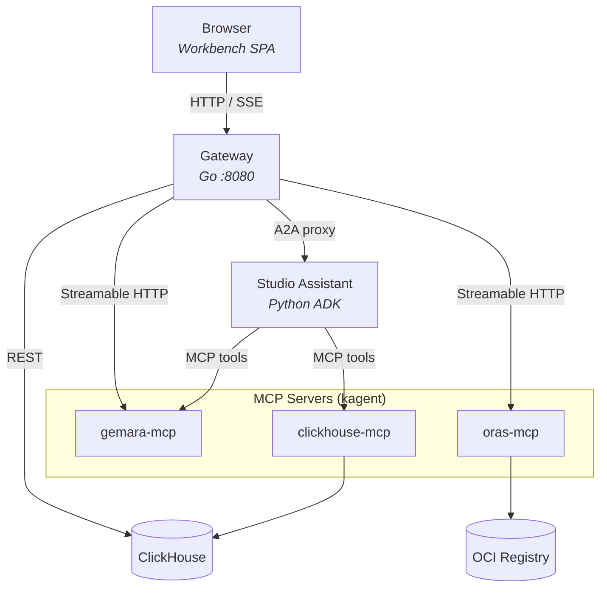
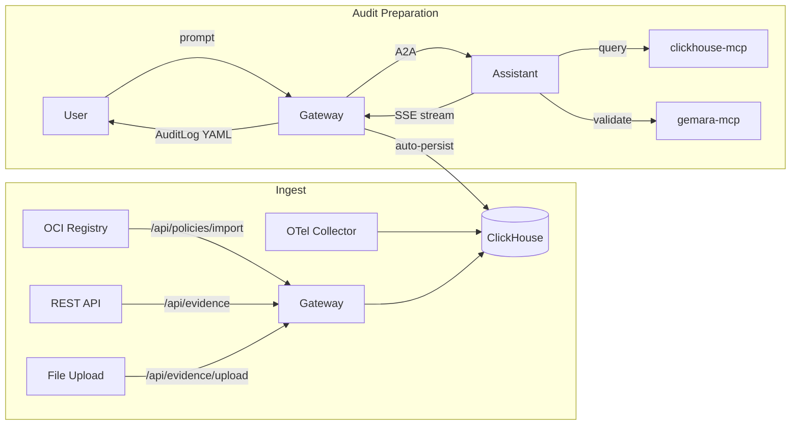

# ComplyTime Studio Architecture

## Overview

Audit dashboard for compliance posture tracking, evidence synthesis, and agentic gap analysis. Stores policies imported from OCI registries, ingests evidence via API/file upload (OTel collector integration planned), and uses a BYO ADK assistant agent to produce Gemara AuditLog artifacts.

Artifact authoring (ThreatCatalogs, ControlCatalogs, Policies) is handled by engineers using local tooling + gemara-mcp. Studio focuses on the **consumption and analysis** side of the compliance lifecycle.

## System Diagram

## Components

### Gateway (Go)

User-facing entry point. Serves the embedded Preact SPA, REST APIs, Google OAuth, and proxies for MCP tools, OCI registries, and A2A agent communication.

| Concern | Implementation |
|:--|:--|
| HTTP server | `net/http.ServeMux` with middleware chain (auth, CORS, security headers) |
| Data access | `internal/store` interfaces (`PolicyStore`, `EvidenceStore`, `AuditLogStore`, `MappingStore`) backed by ClickHouse |
| Authentication | Google OAuth (OpenID Connect) with AES-GCM encrypted session cookies |
| Authorization | `simple-authz` — admin/viewer roles via email allowlist in `ADMIN_EMAILS` |
| A2A proxy | Reverse proxy to agent pods via kagent A2A endpoint |
| Artifact persistence | SSE interceptor auto-persists AuditLog artifacts from A2A stream to ClickHouse |
| MCP proxy | Streamable HTTP client to gemara-mcp |
| OCI operations | ORAS MCP for secure registries, direct HTTP for insecure (dev) registries |
| Schema init | `EnsureSchema` creates tables on startup (90 retries, 2s backoff) |

### Studio Assistant (Python)

BYO ADK agent built with Google Agent Development Kit. Runs as a standalone Kubernetes Deployment.

| Concern | Implementation |
|:--|:--|
| Framework | Google ADK `LlmAgent` + `A2aAgentExecutor` + Starlette/Uvicorn |
| Model | Configurable via `MODEL_NAME` env var |
| Tools | MCP toolsets for gemara-mcp (with resources) and clickhouse-mcp (filtered to `run_select_query`, `list_databases`, `list_tables`) |
| Callbacks | `before_agent` (input validation), `after_agent` (artifact extraction), `before_tool` (SQL injection guard) |
| Skills | Loaded from `/app/skills/*/SKILL.md` at startup, appended to system prompt |
| Few-shot examples | Loaded from `/app/prompts/few-shot/*.yaml` at startup, appended after skills |
| Provenance | `PROMPT_VERSION` (SHA-256 of full instruction) and `MODEL_NAME` injected into A2A artifact metadata |

**State model:** All runtime state is **ephemeral**. Sessions, tasks, artifacts, memory, and credentials use ADK's `InMemory*` services and do not survive pod restarts.

| Service | Scope | On restart |
|:--|:--|:--|
| `InMemorySessionService` | Conversation session (agent turns, tool calls) | Lost — agent starts fresh |
| `InMemoryTaskStore` | A2A task tracking (task ID → state) | Lost — client must start a new task |
| `InMemoryArtifactService` | Artifacts produced during a task | Lost — artifacts already streamed to client via SSE |
| `InMemoryMemoryService` | Long-term memory across sessions | Lost — no long-term memory persists today |
| `InMemoryCredentialService` | OAuth tokens for tool auth | Lost — re-acquired on next tool call |

**Continuity mechanisms:**
- The frontend injects dashboard context and sticky notes into each message via `buildInjectedContext`, providing the agent with situational awareness independent of server-side session state.
- When the A2A `taskId` survives (no pod restart), `streamReply` resumes the existing task and the agent retains full turn history natively.
- Server-side conversation turn storage in the gateway ensures `taskId` and message history survive page refresh. Pod restart still clears agent-side state — this is an accepted tradeoff that will be addressed when auth sessions migrate to durable storage.

### ClickHouse

Primary datastore. Deployed as a StatefulSet with PVC. Two consumer profiles:

- **Gateway (Go):** Batch inserts on ingest, point lookups and list queries for the REST API.
- **Agent (via clickhouse-mcp):** Analytical queries — `GROUP BY`, `JOIN`, `count(DISTINCT)`, `groupArray` over evidence at scale.

| Table | Engine | Partition | TTL | Purpose |
|:--|:--|:--|:--|:--|
| `evidence` | ReplacingMergeTree | `toYYYYMM(collected_at)` | configurable | Evaluation and enforcement results |
| `policies` | ReplacingMergeTree | — | — | Imported policy artifacts |
| `mapping_documents` | ReplacingMergeTree | — | — | Cross-framework crosswalks |
| `mapping_entries` | ReplacingMergeTree | — | — | Structured entries parsed from mapping documents |
| `audit_logs` | ReplacingMergeTree | `toYYYYMM(audit_start)` | configurable | AuditLog artifacts with provenance (`model`, `prompt_version`) |
| `controls` | ReplacingMergeTree | — | — | Parsed L2 ControlCatalog entries |
| `assessment_requirements` | ReplacingMergeTree | — | — | Assessment requirements linked to controls |
| `control_threats` | ReplacingMergeTree | — | — | Junction: controls → threats |
| `threats` | ReplacingMergeTree | — | — | Parsed L2 ThreatCatalog entries |
| `catalogs` | ReplacingMergeTree | — | — | Raw catalog artifacts for backfill |
| `schema_migrations` | ReplacingMergeTree | — | — | Applied migration tracking |

**Schema lifecycle:** `EnsureSchema` runs on every gateway startup. Tables are created via `CREATE TABLE IF NOT EXISTS`. Additive changes (new columns, new tables) are managed via versioned migrations in `schemaMigrations()` — each migration runs at most once, tracked in `schema_migrations`. The `evidence` table is aligned to the `beacon.evidence` OTel semantic convention — see [evidence-semconv-alignment.md](evidence-semconv-alignment.md).

### MCP Servers

Deployed via kagent MCPServer CRDs. The assistant and gateway connect over Streamable HTTP.

| Server | Purpose |
|:--|:--|
| gemara-mcp | Schema validation, artifact migration, Gemara resource access |
| clickhouse-mcp | SQL queries against evidence/audit data |
| oras-mcp | OCI registry operations |

### Workbench (Preact SPA)

Embedded in the gateway binary at build time via `go:embed`. Hash-routed single-page app.

| View / Component | Description |
|:--|:--|
| PostureView | Compliance posture dashboard — pass/fail breakdown across policies |
| PoliciesView | Imported policies with detail view (criteria, assessment requirements) |
| EvidenceView | Evidence inventory with filters (policy, target, control, date range) |
| AuditHistoryView | AuditLog artifacts produced by the assistant |
| ChatAssistant | Floating overlay for agent conversations; server-side session persistence, sticky notes |
| Header | User profile (name, avatar), navigation |
| Sidebar | View navigation (posture, policies, evidence, audit history) |

## Evidence Pipeline

Multiple intake paths feed a single `evidence` table.

| Path | Source | How | Enrichment |
|:-----|:-------|:----|:-----------|
| A — Gemara-native | `complyctl` via ProofWatch | Emits OTel logs → Collector → ClickHouse exporter | `enrichment_status = Success` |
| B — Raw policy engine | OPA, Kyverno, etc. | Emits OTel logs → Collector → truthbeam processor → ClickHouse exporter | `enrichment_status` varies |
| Manual | REST API | `POST /api/evidence` (JSON) or `POST /api/evidence/upload` (CSV) | `enrichment_status = Success` |

The OTel Collector is **environment infrastructure** — Studio does not deploy or manage a collector. The collector's ClickHouse exporter writes directly to the `evidence` table using the attribute→column mapping defined in `evidence-semconv-alignment.md`. See [otel-native-ingestion.md](../decisions/otel-native-ingestion.md) and [otel-collector-out-of-chart.md](../decisions/otel-collector-out-of-chart.md).

## Data Flow

## Authentication and Authorization

| Mode | Trigger | Behavior |
|:--|:--|:--|
| Auth disabled | `GOOGLE_CLIENT_ID` unset | No auth middleware; all APIs open, all users admin |
| Auth enabled | `GOOGLE_CLIENT_ID` set | Google OpenID Connect flow, AES-GCM encrypted cookie, `/api/*` gated |

**Roles:**

| Role | Determination | Permissions |
|:--|:--|:--|
| admin | Email in `ADMIN_EMAILS` allowlist | Full access — import, upload, chat, read |
| viewer | Authenticated but not in allowlist | Read-only — browse policies/evidence, chat |

When `ADMIN_EMAILS` is empty, all authenticated users default to admin. Non-GET requests to `/api/*` require admin role, except `PUT /api/chat/history` (users save their own conversations).

## Helm Configuration

Key values in `charts/complytime-studio/values.yaml`:

| Value | Description |
|:--|:--|
| `model.provider` | LLM provider (default: `AnthropicVertexAI`) |
| `model.name` | Model identifier (default: `claude-opus-4-6`) |
| `model.anthropicVertexAI.projectID` | GCP project for Vertex AI |
| `auth.google.clientId` | Google OAuth client ID (enables auth middleware) |
| `auth.admins` | Email allowlist for admin role (empty = all admin) |
| `clickhouse.enabled` | Deploy ClickHouse evidence store (default: `true`) |
| `gateway.autoPersistArtifacts` | Auto-persist AuditLog artifacts from A2A stream (default: `true`) |
| `registry.enabled` | Deploy in-cluster OCI registry |

## Kubernetes Layout

All resources deploy to the `kagent` namespace.

| Kind | Name | Notes |
|:--|:--|:--|
| Deployment | studio-gateway | Go, includes A2A proxy |
| Deployment | studio-assistant | Python ADK |
| Deployment | studio-gemara-mcp | Managed by KMCP |
| Deployment | studio-clickhouse-mcp | Managed by KMCP |
| Deployment | studio-oras-mcp | Managed by KMCP |
| Deployment | studio-registry | Zot, dev only |
| StatefulSet | studio-clickhouse | PVC-backed |
| ConfigMap | studio-clickhouse-schema | Tuning XML + users config |
| ConfigMap | studio-agent-prompts | System prompts |
| Secret | studio-gcp-credentials | GCP service account |
| Secret | studio-clickhouse-credentials | ClickHouse auth |
| Secret | studio-oauth-credentials | Google OAuth (optional) |
| Agent CRD | studio-assistant | kagent declarative agent |
| MCPServer CRD | gemara-mcp, clickhouse-mcp, oras-mcp | kagent MCP servers |

## Configuration (Environment Variables)

| Variable | Component | Purpose |
|:--|:--|:--|
| `CLICKHOUSE_ADDR` | Gateway | ClickHouse native protocol address |
| `GEMARA_MCP_URL` | Gateway, Assistant | Gemara MCP HTTP endpoint |
| `CLICKHOUSE_MCP_URL` | Assistant | ClickHouse MCP HTTP endpoint |
| `ORAS_MCP_URL` | Gateway | ORAS MCP HTTP endpoint |
| `A2A_PROXY_URL` | Gateway | Forward A2A traffic to external proxy (future extraction) |
| `AGENT_DIRECTORY` | Gateway | JSON array of agent cards |
| `MODEL_NAME` | Assistant | LLM model identifier |
| `GOOGLE_CLIENT_ID` | Gateway | Enables Google OAuth when set |
| `COOKIE_SECRET` | Gateway | 32-byte hex key for session encryption |
| `ADMIN_EMAILS` | Gateway | Comma-separated admin email allowlist |
| `AUTO_PERSIST_ARTIFACTS` | Gateway | Enable artifact auto-persistence (default: `true`) |
