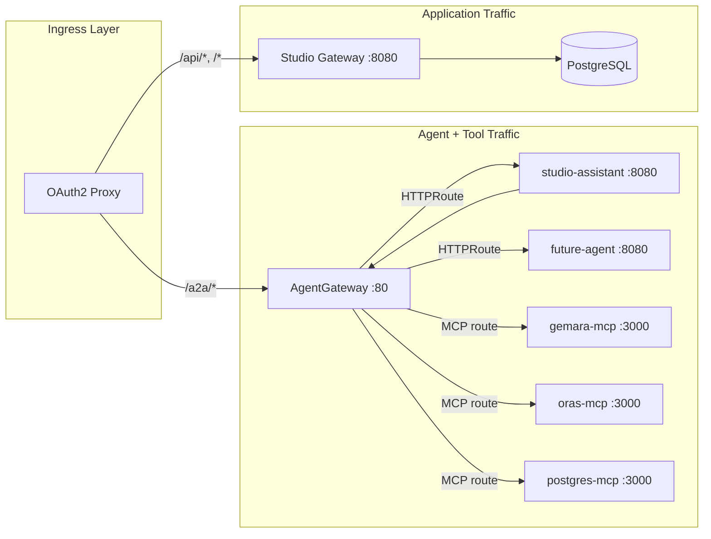

# Design: AgentGateway Production Routing

## BLUF

Replace the custom A2A reverse proxy and kagent controller hot-path routing with AgentGateway — the production ingress pattern kagent prescribes. AgentGateway handles all agent (A2A) and tool (MCP) traffic with protocol-aware routing, OTel observability, and CEL-based tool access enforcement. Studio gateway retains only CRUD, SPA, and the agent directory API.

## Current Architecture

```
Browser → Studio Gateway (custom proxy) → kagent-controller:8083 → agent pod
Agent pod → direct HTTP → MCP service (no access control)
```

- `registerA2AProxy` (200 LOC) rewrites paths to `/api/a2a/{namespace}/{agent}/`
- kagent-controller:8083 is the same endpoint used by `kagent invoke` CLI
- MCP tool allowlists in `agent.yaml` are unenforced documentation
- KMCP already deploys AgentGateway sidecars for MCPServer CRDs

## Target Architecture

```
Browser ─── /a2a/* ──→ AgentGateway ──→ agent pods (A2A)
       │                     ↑ agent pods connect here for MCP too
       │                     └──→ MCP pods (tool traffic, CEL-gated)
       │
       └── /api/* ───→ Studio Gateway ──→ Postgres, SPA, directory API
```



## Decisions

### 1. User-directed routing (no LLM delegation)

The workbench agent picker is the orchestrator. User selects which agent to talk to. Deterministic, transparent, auditable. No `a2a_delegate` tool.

**Rationale:** LLM-driven delegation is non-deterministic, opaque to the user, and adds latency. The compliance persona needs auditability — who answered, which tools were used, full attribution chain.

### 2. Align with kagent production architecture

kagent docs: "you could also expose the A2A endpoint publicly by using a gateway."
kmcp docs: add `kagent.dev/discovery=disabled` label so "agent-tool traffic is routed correctly through agentgateway."

AgentGateway is already deployed in the cluster as KMCP sidecars for stdio MCP bridging. This change deploys it as a standalone proxy for the production ingress.

### 3. Studio gateway exits the A2A path

Browser talks directly to AgentGateway for agent traffic via ingress path split. Eliminates a network hop, removes the gateway as a single point of failure for conversations, and separates long-lived SSE streams from short-lived CRUD requests.

### 4. MCP traffic routed through AgentGateway with tool enforcement

Agent pods connect to MCP through AgentGateway. CEL policies enforce per-agent tool allowlists derived from `agentDirectory[].tools` in values.yaml. Deny-all default — unenumerated tools are rejected before reaching the MCP server.

### 5. Auth: OAuth2 Proxy pass-through

OAuth2 Proxy handles OIDC, injects `Authorization: Bearer` header. AgentGateway passes headers to backends unchanged. No OIDC config on AgentGateway itself.

Future: JWT validation + CEL on claims when per-agent user RBAC is needed.

### 6. Local dev uses kind (same topology)

No dev-mode fallback code. `deploy/kind/setup.sh` bootstraps AgentGateway alongside kagent. One topology everywhere.

## Agent Directory Schema

`agentDirectory` in values.yaml serves three purposes:
1. Powers workbench agent picker (`GET /api/agents`)
2. Generates `AgentgatewayBackend` + `HTTPRoute` per agent (Helm)
3. Generates CEL tool-access policies (Helm)

```yaml
agentDirectory:
  - id: studio-assistant
    name: Studio Assistant
    description: >-
      Audit preparation, evidence synthesis, cross-framework
      coverage analysis, and compliance guidance
    role: auditor
    framework: adk
    status: active
    tools: [validate_gemara_artifact, migrate_gemara_artifact, query_database, get_schema_info]
    examples:
      - "Run an audit for the ampel-branch-protection policy"
      - "Check posture for the last 30 days"
    skills:
      - id: compliance-assistant
        name: Studio Assistant
        description: >-
          Audit preparation, evidence synthesis, cross-framework coverage
          analysis, policy guidance, and AuditLog generation.
        tags: [assistant, audit, compliance, coverage, evidence, layer-7]
```

| Field | Purpose |
|:--|:--|
| `id` | Stable identifier, routing key (HTTPRoute path prefix) |
| `name` | Display name in workbench picker |
| `role` | Function label (auditor, evidence-analyst, threat-modeler) |
| `framework` | Runtime hint (adk, langgraph, custom) |
| `status` | `active` or `hidden` (hidden excluded from `GET /api/agents`) |
| `tools` | MCP tools granted — source for CEL enforcement policies |
| `examples` | Example queries shown in workbench picker |
| `skills` | A2A skill metadata (mirrors `agent.yaml` a2a.skills) |

## Gateway Code Removal

| Delete | Reason |
|:--|:--|
| `registerA2AProxy` (internal/agents/agents.go:126-205) | Replaced by AgentGateway HTTPRoutes |
| `RegisterA2AProxy` export | Dead code |
| `RegisterA2AForward` | No dev-mode fallback (kind everywhere) |
| `Options.KagentA2AURL`, `Options.AgentNamespace` | kagent exits A2A path |
| `KAGENT_A2A_URL` env in gateway template | Not needed |
| `KAGENT_AGENT_NAMESPACE` env in gateway template | Not needed |
| `A2A_PROXY_URL` env read in main.go | Browser hits AgentGateway directly |

**Retained:** `GET /api/agents` directory handler, `registerGemaraProxy` (workbench validation).

## BYO Agent Onboarding

Operator registers a new agent in 3 steps:

1. **Container** — serve A2A at `/` (use `kagent-langgraph` for LangGraph, Google ADK for Python)
2. **kagent BYO CRD** — add template to Helm chart (kagent manages Deployment + Service)
3. **`agentDirectory` entry** — add to values.yaml with `id`, `name`, `role`, `framework`, `status`, `tools`, `examples`

Helm automatically renders `AgentgatewayBackend` + `HTTPRoute` + CEL policies from the directory entry.

## Risks

| Risk | Mitigation |
|:--|:--|
| AgentGateway becomes single point of failure for all agent + MCP traffic | `replicas: 2+` in production values; health checks on Gateway resource |
| CEL policy syntax for MCP tool filtering not verified against AgentGateway API | Spike: deploy and test CEL `request.mcp.tool` expression before full implementation |
| Gateway API CRDs not installed in kind cluster | Add to `deploy/kind/setup.sh` (AgentGateway Helm chart installs them) |
| Workbench cookie not sent on `/a2a/` path (different prefix) | Same domain, same origin — `credentials: "same-origin"` still works |
| Agent pods need `X-Agent-ID` header for CEL enforcement | Set in agent MCP client config (env var or ADK toolset config) |
