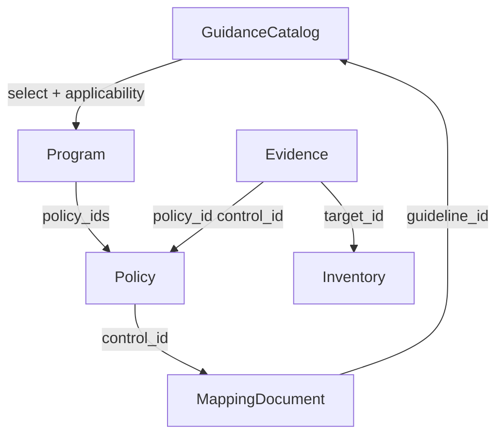

# Design: View Consolidation

## BLUF

Studio models compliance as **Programs** (framework obligations scoped by guidance + applicability) that aggregate **Policies** (internal ControlCatalog-backed governance), linked by **MappingDocuments**, proven by **Evidence**, and summarized by **Posture** computed on evidence ingest over NATS. The workbench exposes six primary routes plus Settings; cross-navigation standardized on filter chips and URL-driven initial scope.

## Domain Model

Hierarchy: imported **GuidanceCatalog** seeds program scope; **Program** rows bind `guidance_catalog_id`, `applicability[]`, and `policy_ids[]`; **Policy** holds internal requirements; **MappingDocument** maps controls to guidelines; **Evidence** ties evaluations to policy controls and inventory **targets**. **Posture** answers coverage of guidance entries reachable through mappings with passing evidence.

| Entity | Role |
|:--|:--|
| GuidanceCatalog | External obligation catalog; `guidance_entries` carry applicability for baseline scoping |
| Program | Operational compliance envelope: framework slice, assigned policies, health thresholds |
| Policy | Internal Policy leaf + unpacked catalogs (controls, guidance fragments, threats/risks as imported) |
| MappingDocument | Crosswalk; validates catalog IDs at import |
| Evidence | EvaluationLog ingestion; triggers posture recompute |
| Posture | Derived: guideline coverage via mappings + evidence outcomes |
| Inventory | Aggregated target-level rollup (API + standalone view) |

## Navigation Structure

| Slot | Responsibility |
|:--|:--|
| Dashboard | Landing metrics, actionable items, deep-links with pre-applied filters (no separate datastore) |
| Programs | Program CRUD, create-from-guidance flow, detail: posture, assignments, recommendations |
| Policies | List/detail, requirement matrix, program filter, unified import entry |
| Inventory | Target-centric table; policy/program/type/environment filters |
| Evidence | Traceability chain; policy/program/target/control filters |
| Reviews | Cross-program draft queue; workspace with inline evidence projection + promote |
| Settings | Gear at sidebar foot; admin-only system configuration |

Auxiliary: chat assistant remains FAB overlay; header **Import** persists globally.

## Unified Import Flow

| Step | Behavior |
|:--|:--|
| 1 | Client posts artifact payload to `POST /api/import` |
| 2 | Server auto-detects Gemara artifact type from content |
| 3 | Router delegates to catalog/policy/mapping handlers as today |
| 4 | Policy **bundle**: `go-gemara` unpack extracts leaf + nested artifacts by annotation |
| 5 | Each artifact persists in canonical tables (`policies`, `catalogs`, `controls`, `guidance_entries`, etc.) |
| 6 | MappingDocument import validates referenced catalog IDs exist |
| 7 | Post-import UX surfaces mapping gap hint when a new policy has no mappings |

Importable via UI: Policy (bundle), GuidanceCatalog, ControlCatalog, ThreatCatalog, RiskCatalog, MappingDocument. Evidence logs remain pipeline/API ingest only.

## Recommendation Engine

| Input | Use |
|:--|:--|
| Mapping overlap | Primary rank: policy controls intersect program guideline set |
| Evidence quality | Context for confidence / uplift narrative |
| Mapping strength | Context for partial vs strong coverage |

| Rule | Detail |
|:--|:--|
| Invocation | On-demand when Program detail recommendations panel opens (not background polling) |
| Action | One-click **Attach** adds policy id to program `policy_ids` |
| Eligibility | Writers and admins only |
| Dismissals | Per-program, persistent; optional reason; panel can disable suggestions |

## Posture Computation

| Topic | Decision |
|:--|:--|
| Trigger | Evidence ingest publishes NATS event; subscriber recomputes affected programs |
| MVP Scope | Per-policy evidence rollup for program `policy_ids`; pass/fail/error/unknown aggregation with green/yellow/red health thresholds |
| Future | Guideline-level posture via mapped controls filtered by program `applicability` (requires mapping join enrichment) |
| Signal | Latest evidence per (target, policy) grain drives score |
| Regressions | Health change emits notification reused by Dashboard/Reviews badges |
| Surfaces | Program detail summary; batch endpoints for dashboard cards |

## Role Model

| Role | Access |
|:--|:--|
| Admin | User management, settings, all operational mutations |
| Writer | Programs, policies, imports, recommendations attach/dismiss; not user admin |
| Reviewer | Read programs/posture; audit log review and promotion workflow |

Middleware extends `writeProtect`: writer authorized for content paths; settings and identity admin remain admin-only.

## Stripe Design System Adoption

Adapt [Stripe Open Design](https://github.com/nexu-io/open-design/blob/main/design-systems/stripe/DESIGN.md) tokens to `workbench/src/global.css` custom properties:

| Token area | Mapping |
|:--|:--|
| Typography | `Inter` stack; 300/400 weights; navy headings (`#061b31`), slate body |
| Space | 8px base grid; compact density |
| Radius | 4–8px conservative rounding |
| Elevation | Blue-tinted layered shadows (`rgba(50,50,93,0.25)` family) |
| Status | Green success (`#15be53`); preserve semantic warning/error palette |
| Dark | Deep indigo surfaces (`#1c1e54`) vs pure black |

Layout structure (sidebar, main grid) unchanged; tokens drive color, type, and shadow refresh.

## Filter Chip Cross-Navigation

Follow `docs/decisions/filter-chip-pattern.md`:

| Rule | Detail |
|:--|:--|
| Visualization | Active filters render as dismissible chips above tables |
| Sources | URL params, dashboard deep-links, in-view controls |
| Logic | Multiple chips AND-combine |
| Sync | Clearing chip resets matching dropdown/query state |
| Scope | Evidence, Policies, Inventory, cross-links from Dashboard and Program detail |

Reviews workspace keeps an **exception**: inline read-only evidence provenance table for high-volume audit decisions without duplicating Evidence as a parallel source of truth elsewhere.
